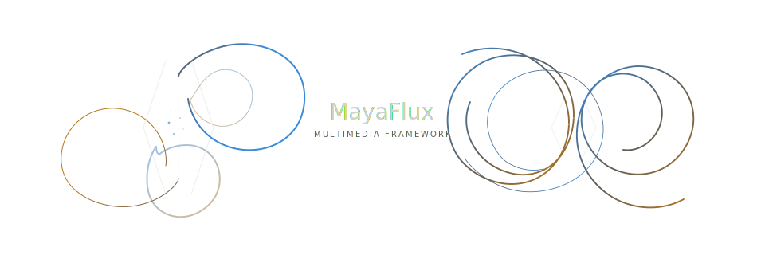

# MayaFlux

[](LICENSE)
[](https://en.cppreference.com/w/cpp/20)
[](https://cmake.org/)
[]()

> **A C++20/23 framework for real-time computation across sound, geometry, image, and network: unified at the substrate level, not bridged at the API level.**



Sound, geometry, image, and control data are not separate domains in MayaFlux. They are the same numerical substrate with a scheduling annotation deciding where each buffer cycle goes. A field driving mesh vertex deformation is the same field shaping granular reconstruction of audio. A network message routes into the node graph, triggers a coroutine, and reshapes geometry and audio simultaneously. Zero-copy views mean audio is not converted to texture: it is texture, accessed through a different lens over the same memory.

The coordination problem this creates is real: audio runs in hardware callbacks, graphics on frame-rate cycles, input arrives asynchronously, user code needs flexible timing. MayaFlux handles this through lock-free dispatch, C++20 coroutines, and compile-time data abstraction (no mutexes) in the real-time path, no domain-specific rewrites at execution context boundaries, no central scheduler overhead.

The closest reference points are early Blender and openFrameworks: independent, flexible infrastructure for computation that produces sound and image. Not a DAW, plugin host, or audio library.

For comprehensive onboarding, tutorials, design context, and philosophy, visit [the website](https://mayaflux.org)

For news around `0.3` release, follow this article which will receive video updates in short order: [The shape of material](https://mayaflux.org/releases/news/the_shape_of_material/)

---

## The Architecture

Four execution contexts with non-negotiable constraints form the foundation:

- **RtAudio callbacks**: Sample-accurate, zero-allocation, no blocking
- **Vulkan render threads**: Frame-rate execution, GPU command recording, swapchain timing
- **Async input backends**: Event-driven, hardware-interrupt-adjacent, unpredictable arrival
- **User coroutines**: Flexible timing, compositional, must not compromise the above

Coordination across these contexts rests on three technical foundations:

- **Lock-free as foundation**: `atomic_ref`, CAS-based dispatch, zero-mutex registration across thread boundaries. No mutexes anywhere in the real-time path.
- **Coroutines as the weaving layer**: Temporal intent survives thread transitions without central scheduler overhead. Time becomes compositional material rather than a constraint.
- **Compile-time data unification**: Concepts and data views eliminate context-boundary copies that destroy performance. Audio, video, geometry, and control data share processing primitives without translation layers.

---

## Processing Model

Five composable abstractions implement this across all domains:

| Component               | What It Does                                                                                  |
| ----------------------- | --------------------------------------------------------------------------------------------- |
| **Nodes**               | Unit-by-unit transformation precision; mathematical relationships become creative decisions   |
| **Buffers**             | Temporal gathering spaces accumulating data without blocking or unnecessary allocation        |
| **Coroutines**          | C++20 primitives treating time itself as malleable, compositional material                    |
| **Containers (NDData)** | Multi-dimensional data structures unifying audio, video, spectral, and tensor representations |
| **Compute Matrix**      | Composable and expressive semantic pipelines to analyze, sort, extract and transform NDData   |

All abstractions are composable and concurrent. Processing domains are encoded via bit-field tokens enabling type-safe cross-modal coordination. Audio, graphics, and control data operate on the same underlying primitives, not bolted together through adapters, but unified at the architectural level.

---

## In Practice

MayaFlux is not about producing a particular audiovisual result that cannot be replicated elsewhere. Such novelties are neither the point, nor interesting even if true.

It's about making the structure of computation fluid enough that small changes open entirely different creative possibilities.
The ideas, their ontology, and how they compose drive the work. Not mastering the API. Not fighting it.

The two examples below are the same sound engine. The second changes roughly 20 lines. What those 20 lines unlock is not a variation on the first, it's a different compositional universe.

<a href="https://youtu.be/OecKzGCxpRM" target="_blank">
 
</a>

<details>
<summary>Example 1: Bouncing Bell</summary>

A modal resonator body with dynamic spatial identity. A sine oscillator provides continuous motion that becomes a structural timing source via zero-crossing detection.
Each crossing excites the resonator, randomises its fundamental, and alternates its stereo position. The same oscillator value drives visual color and spiral growth.
Three visual modes (spiral accumulation, localized burst, distributed field), share the same audio engine and switch at runtime. Mouse position maps directly to strike position and pitch.

```cpp
void bouncing_bell()
{
    // Unified audiovisual playground with multiple representation modes
    auto window = create_window({ .title = "Bouncing Bell", .width = 1920, .height = 1080 });

    // System memory: timing, spatial alternation, visual accumulation, representation mode
    struct State {
        double last_wobble = 0.0; // previous oscillator value for transition detection
        uint32_t side = 0; // stereo side toggle
        float angle = 0.0F; // spiral phase memory
        float radius = 0.0F; // spiral growth memory
        bool explode = false; // reserved structural flag (future extension)
        int visual = 0; // 0=spiral, 1=burst, 2=field
    };
    auto state = std::make_shared<State>();

    // Single resonant body — spatial identity is dynamic
    auto bell = vega.ModalNetwork(12, 220.0, ModalNetwork::Spectrum::INHARMONIC);

    // Slow continuous motion becomes structural timing source
    auto wobble = vega.Sine(0.3, 1.0);

    // Continuous → discrete event (structural bounce)
    auto swing = vega.Logic([state](double x) {
        bool crossed = (state->last_wobble < 0.0) && (x >= 0.0);
        state->last_wobble = x;
        return crossed;
    });
    wobble >> swing;

    // Each bounce excites the body and flips spatial polarity
    swing->on_change_to(true, [bell, state](auto&) {
        bell->excite(get_uniform_random(0.5F, 0.9F));
        bell->set_fundamental(get_uniform_random(200.0F, 800.0F));

        route_network(bell, { state->side }, 0.15);
        state->side = 1 - state->side; // alternate left/right
    });

    // Oscillator also shapes decay — timing signal influences physical response
    bell->map_parameter("decay", wobble, MappingMode::BROADCAST);

    // High-capacity visual field for multiple accumulation strategies
    auto points = vega.PointCollectionNode(2000) | Graphics;
    auto geom = vega.GeometryBuffer(points) | Graphics;
    geom->setup_rendering({ .target_window = window });
    window->show();

    // Representation layer: same sound, multiple visual ontologies
    schedule_metro(0.016, [points, bell, wobble, state]() {
        float energy = bell->get_audio_buffer().has_value()
            ? (float)rms(bell->get_audio_buffer().value()) * 5.0F
            : 0.0F;

        auto wobble_val = (float)wobble->get_last_output(); // continuous state influences color and motion
        float hue = (wobble_val + 1.0F) * 0.5F;
        float x_pos = (state->side == 0) ? -0.5F : 0.5F;

        if (state->visual == 0) {
            // Mode 0: spiral accumulation (memory + growth)
            if (energy > 0.1F) {
                state->angle += 0.5F + wobble_val * 0.3F;
                state->radius += 0.002F;
            } else {
                state->angle += 0.01F;
                state->radius += 0.0001F;
            }

            if (state->radius > 1.0F) {
                state->radius = 0.0F;
                points->clear_points(); // visual cycle reset
            }

            points->add_point({ .position = glm::vec3(
                                    std::cos(state->angle) * state->radius,
                                    std::sin(state->angle) * state->radius * (16.0F / 9.0F),
                                    0.0F),
                .color = glm::vec3(hue, 0.8F, 1.0F - hue),
                .size = 8.0F + energy * 15.0F });

        } else if (state->visual == 1) {
            // Mode 1: localized burst (energy → multiplicity)
            for (int i = 0; i < (int)(energy * 80); i++) {
                auto a = (float)get_uniform_random(0.0F, 6.28F);
                auto r = (float)get_uniform_random(0.01F, 0.05F);

                points->add_point({ .position = glm::vec3(x_pos + std::cos(a) * r, std::sin(a) * r, 0.0F),
                    .color = glm::vec3(energy, 0.5F, 1.0F - energy),
                    .size = (float)get_uniform_random(5.0F, 20.0F) });
            }

            if (points->get_point_count() > 2000) {
                points->clear_points(); // density control
            }

        } else {
            // Mode 2: distributed field (energy → spatial diffusion)
            for (int i = 0; i < (int)(energy * 60); i++) {
                points->add_point({ .position = glm::vec3(
                                        (float)get_uniform_random(-0.8F, 0.8F),
                                        (float)get_uniform_random(-0.8F, 0.8F),
                                        0.0F),
                    .color = glm::vec3(hue, energy, 1.0F - hue),
                    .size = 3.0F + energy * 5.0F });
            }

            if (points->get_point_count() > 2000) {
                points->clear_points(); // prevent runaway accumulation
            }
        }
    });

    // Direct physical interaction: position maps to pitch and intensity
    on_mouse_pressed(window, IO::MouseButtons::Left, [window, bell](double x, double y) {
        glm::vec2 pos = normalize_coords(x, y, window);
        float pitch = 200.0F + ((float)pos.y + 1.0F) * 300.0F;
        float intensity = 0.3F + std::abs((float)pos.x) * 0.6F;
        bell->set_fundamental(pitch);
        bell->excite(intensity);
    });

    // Switch representation modes (same sound engine, different interpretation)
    on_key_pressed(window, IO::Keys::N1, [points, state]() { state->visual = 0; points->clear_points(); });
    on_key_pressed(window, IO::Keys::N2, [points, state]() { state->visual = 1; points->clear_points(); });
    on_key_pressed(window, IO::Keys::N3, [points, state]() { state->visual = 2; points->clear_points(); });

    // Collapse spatial polarity
    on_key_pressed(window, IO::Keys::M, [bell]() { route_network(bell, { 0, 1 }, 0.3); });
}
```

</details>

<details>
<summary>Example 2: Bouncing Bell (extended)</summary>

The resonator gains modal coupling between adjacent modes, a slow pitch drift oscillator mapped directly into the network's frequency parameter and into visual hue simultaneously, and a runtime-swappable rhythm source (slow sine, fast sine, random noise) wired through the same zero-crossing logic node. Mouse now maps to strike position on the resonator body rather than pitch. Space cycles the rhythm source at runtime without stopping anything.

The audio engine is structurally identical. The relationships between signals changed.

```cpp
void bouncing_v2()
{
    // Unified audiovisual playground with multiple representation modes
    auto window = create_window({ .title = "Bouncing Bell", .width = 1920, .height = 1080 });

    // System memory: timing, spatial alternation, visual accumulation, representation mode
    struct State {
        double last_wobble = 0.0; // previous oscillator value for transition detection
        uint32_t side = 0; // stereo side toggle
        float angle = 0.0F; // spiral phase memory
        float radius = 0.0F; // spiral growth memory
        bool explode = false; // reserved structural flag (future extension)
        int visual = 0; // 0=spiral, 1=burst, 2=field
    };
    auto state = std::make_shared<State>();

    // Single resonant body — spatial identity is dynamic
    auto bell = vega.ModalNetwork(12, 220.0, ModalNetwork::Spectrum::INHARMONIC);

    // Slow continuous motion becomes structural timing source
    auto wobble = vega.Sine(0.3, 1.0);

    // Continuous → discrete event (structural bounce)
    auto swing = vega.Logic([state](double x) {
        bool crossed = (state->last_wobble < 0.0) && (x >= 0.0);
        state->last_wobble = x;
        return crossed;
    });
    wobble >> swing;

    // Each bounce excites the body and flips spatial polarity
    swing->on_change_to(true, [bell, state](auto&) {
        bell->excite(get_uniform_random(0.5F, 0.9F));
        bell->set_fundamental(get_uniform_random(200.0F, 800.0F));

        route_network(bell, { state->side }, 0.15);
        state->side = 1 - state->side; // alternate left/right
    });

    // Oscillator also shapes decay — timing signal influences physical response
    bell->map_parameter("decay", wobble, MappingMode::BROADCAST);

    // High-capacity visual field for multiple accumulation strategies
    auto points = vega.PointCollectionNode(2000) | Graphics;
    auto geom = vega.GeometryBuffer(points) | Graphics;
    geom->setup_rendering({ .target_window = window });
    window->show();

    // Representation layer: same sound, multiple visual ontologies
    schedule_metro(0.016, [points, bell, wobble, state]() {
        float energy = bell->get_audio_buffer().has_value()
            ? (float)rms(bell->get_audio_buffer().value()) * 5.0F
            : 0.0F;

        auto wobble_val = (float)wobble->get_last_output(); // continuous state influences color and motion
        float hue = (wobble_val + 1.0F) * 0.5F;
        float x_pos = (state->side == 0) ? -0.5F : 0.5F;

        if (state->visual == 0) {
            // Mode 0: spiral accumulation (memory + growth)
            if (energy > 0.1F) {
                state->angle += 0.5F + wobble_val * 0.3F;
                state->radius += 0.002F;
            } else {
                state->angle += 0.01F;
                state->radius += 0.0001F;
            }

            if (state->radius > 1.0F) {
                state->radius = 0.0F;
                points->clear_points(); // visual cycle reset
            }

            points->add_point({ .position = glm::vec3(
                                    std::cos(state->angle) * state->radius,
                                    std::sin(state->angle) * state->radius * (16.0F / 9.0F),
                                    0.0F),
                .color = glm::vec3(hue, 0.8F, 1.0F - hue),
                .size = 8.0F + energy * 15.0F });

        } else if (state->visual == 1) {
            // Mode 1: localized burst (energy → multiplicity)
            for (int i = 0; i < (int)(energy * 80); i++) {
                auto a = (float)get_uniform_random(0.0F, 6.28F);
                auto r = (float)get_uniform_random(0.01F, 0.05F);

                points->add_point({ .position = glm::vec3(x_pos + std::cos(a) * r, std::sin(a) * r, 0.0F),
                    .color = glm::vec3(energy, 0.5F, 1.0F - energy),
                    .size = (float)get_uniform_random(5.0F, 20.0F) });
            }

            if (points->get_point_count() > 2000) {
                points->clear_points(); // density control
            }

        } else {
            // Mode 2: distributed field (energy → spatial diffusion)
            for (int i = 0; i < (int)(energy * 60); i++) {
                points->add_point({ .position = glm::vec3(
                                        (float)get_uniform_random(-0.8F, 0.8F),
                                        (float)get_uniform_random(-0.8F, 0.8F),
                                        0.0F),
                    .color = glm::vec3(hue, energy, 1.0F - hue),
                    .size = 3.0F + energy * 5.0F });
            }

            if (points->get_point_count() > 2000) {
                points->clear_points(); // prevent runaway accumulation
            }
        }
    });

    // Direct physical interaction: position maps to pitch and intensity
    on_mouse_pressed(window, IO::MouseButtons::Left, [window, bell](double x, double y) {
        glm::vec2 pos = normalize_coords(x, y, window);
        float pitch = 200.0F + ((float)pos.y + 1.0F) * 300.0F;
        float intensity = 0.3F + std::abs((float)pos.x) * 0.6F;
        bell->set_fundamental(pitch);
        bell->excite(intensity);
    });

    // Switch representation modes (same sound engine, different interpretation)
    on_key_pressed(window, IO::Keys::N1, [points, state]() { state->visual = 0; points->clear_points(); });
    on_key_pressed(window, IO::Keys::N2, [points, state]() { state->visual = 1; points->clear_points(); });
    on_key_pressed(window, IO::Keys::N3, [points, state]() { state->visual = 2; points->clear_points(); });

    // Collapse spatial polarity
    on_key_pressed(window, IO::Keys::M, [bell]() { route_network(bell, { 0, 1 }, 0.3); });
}
```

</details>

## In Practice: Rhythm as Topology

The previous examples showed how a single modal resonator could become an entirely different compositional instrument by changing 20 lines. The same principle applies at larger scale.

The three examples below share the same audio engine: a four-voice rhythm section (kick, snare, hat, clap) built from phasors, envelopes, and noise filters. What changes across them is the visual substrate, the relationship between rhythmic events and spatial form, and eventually the computational depth of those relationships.

Each step adds a layer. Each layer opens a different creative universe. By Example 3, audio envelope nodes feed directly into GPU push constants through `NodeBindingsProcessor`, the same `Polynomial` node that shapes a kick's decay curve is simultaneously warping a fragment shader's radial distortion. No bridging code, no callback extraction, no domain translation. The node outputs a number; the GPU consumes it.

<a href="https://youtu.be/SHWebquQbZs" target="_blank">
 
</a>

<details>
<summary>Example 1: Living Topology</summary>

A four-voice rhythm engine drives a point cloud connected by proximity topology. Kick expands the field radially. Snare triggers topology regeneration and applies rotational shear. Hat cycles between proximity algorithms (minimum spanning tree, k-nearest, nearest neighbor, sequential) every 16 hits. Clap injects positional jitter into individual points.

The topology IS the content. Rhythm becomes spatial relationship.

```cpp
void rhythm_topology_live()
{
    auto window = create_window({ .title = "Living Topology",
        .width = 1920,
        .height = 1080 });

    constexpr size_t N = 34;

    struct State {
        bool sequencing {};
        bool chaos_mode {};
        float expansion {};
        float shear {};
        uint32_t hat_count {};
        uint32_t mode_idx {};
        std::vector<glm::vec3> home = std::vector<glm::vec3>(N);
        std::vector<glm::vec3> jitter = std::vector<glm::vec3>(N, glm::vec3(0.0F));
    };
    auto state = std::make_shared<State>();

    // === AUDIO ===

    auto kick_phasor = vega.Phasor(20.0, 1.0);
    auto kick_env = vega.Polynomial([](double x) { return std::exp(-x * 15.0); });
    kick_env->set_input_node(kick_phasor);
    auto kick = vega.Sine(55.0) | Audio[0];
    kick->set_amplitude_modulator(kick_env);

    auto snare_phasor = vega.Phasor(30.0, 1.0);
    auto snare_env = vega.Polynomial([](double x) { return std::exp(-x * 25.0); }) | Audio[1];
    snare_env->set_input_node(snare_phasor);
    auto snare_noise = vega.Random();
    auto snare = (vega.FIR(snare_noise, std::vector { 0.3, 0.4, 0.3 })) * snare_env;
    register_audio_node(snare, 1);

    auto hat_phasor = vega.Phasor(50.0, 1.0);
    auto hat_env = vega.Polynomial([](double x) { return std::exp(-x * 50.0); });
    hat_env->set_input_node(hat_phasor);
    auto hat = vega.Sine(8000.0) | Audio[0];
    hat->set_amplitude_modulator(hat_env);

    auto clap_phasor = vega.Phasor(40.0, 1.0);
    auto clap_env = vega.Polynomial([](double x) {
        return std::exp(-x * 35.0) * (1.0 + 0.3 * std::sin(x * 200.0));
    });
    clap_env->set_input_node(clap_phasor);
    auto clap = (vega.FIR(vega.Random(), std::vector { 0.1, 0.2, 0.4, 0.2, 0.1 })) * clap_env;
    register_audio_node(clap, 0);

    auto bass = vega.Sine(42.0) | Audio[{ 0, 1 }];
    bass->set_amplitude_modulator(vega.Sine(0.15, 0.12));

    // === TOPOLOGY ===

    auto topo = vega.TopologyGeneratorNode(
                    Kinesis::ProximityMode::MINIMUM_SPANNING_TREE,
                    false,
                    N)
        | Graphics;

    {
        Kinesis::Stochastic::Stochastic rng;
        Kinesis::SamplerBounds bounds { glm::vec3(-0.65F), glm::vec3(0.65F) };
        auto samples = Kinesis::generate_samples(
            Kinesis::SpatialDistribution::LISSAJOUS, N, bounds, rng);
        for (size_t i = 0; i < N; ++i) {
            state->home[i] = samples[i].position;
            topo->add_point({ .position = samples[i].position,
                .color = samples[i].color,
                .thickness = 1.5F });
        }
        topo->regenerate_topology();
    }

    auto buffer = vega.GeometryBuffer(topo) | Graphics;
    buffer->setup_rendering({ .target_window = window,
        .topology = Portal::Graphics::PrimitiveTopology::LINE_LIST });

    window->show();

    // === SEQUENCING ===

    schedule_metro(0.5, [kick_phasor, state]() {
        if (!state->sequencing) return;
        kick_phasor->reset();
        state->expansion = std::min(state->expansion + 0.25F, 1.2F);
    }, "kick_layer");

    /// @brief Snare: regenerate topology from current deformed positions
    schedule_pattern(
        [state](uint64_t step) {
            if (state->chaos_mode)
                return get_uniform_random(0.0, 1.0) > 0.6;
            return (step % 4 == 2);
        },
        [snare_phasor, topo, state](std::any hit) {
            if (!state->sequencing)
                return;
            if (std::any_cast<bool>(hit)) {
                snare_phasor->reset();
                state->shear += 0.2F;
                topo->regenerate_topology();
            }
        },
        0.25, "snare_pattern");

    /// @brief Hat: cycle proximity mode every 16 hits
    schedule_pattern(
        [state](uint64_t step) {
            if (state->chaos_mode)
                return get_uniform_random(0.0, 1.0) > 0.5;
            return true;
        },
        [hat_phasor, topo, state](std::any hit) {
            if (!state->sequencing)
                return;
            if (std::any_cast<bool>(hit)) {
                hat_phasor->reset();
                state->hat_count++;
                if (state->hat_count >= 16) {
                    state->hat_count = 0;
                    static constexpr std::array modes = {
                        Kinesis::ProximityMode::MINIMUM_SPANNING_TREE,
                        Kinesis::ProximityMode::K_NEAREST,
                        Kinesis::ProximityMode::NEAREST_NEIGHBOR,
                        Kinesis::ProximityMode::SEQUENTIAL,
                    };
                    state->mode_idx = (state->mode_idx + 1) % modes.size();
                    topo->set_connection_mode(modes[state->mode_idx]);
                }
            }
        },
        0.125, "hat_pattern");

    /// @brief Clap: jitter burst
    schedule_pattern(
        [state](uint64_t step) {
            if (state->chaos_mode)
                return get_uniform_random(0.0, 1.0) > 0.8;
            return (step % 8 == 5);
        },
        [clap_phasor, state](std::any hit) {
            if (!state->sequencing)
                return;
            if (std::any_cast<bool>(hit)) {
                clap_phasor->reset();
                for (auto& j : state->jitter)
                    j = glm::vec3(
                        static_cast<float>(get_uniform_random(-0.1, 0.1)),
                        static_cast<float>(get_uniform_random(-0.1, 0.1)),
                        0.0F);
            }
        },
        0.25, "clap_pattern");

    // === DEFORMATION ===

    schedule_metro(0.016, [topo, kick, bass, state]() {
        float kick_e = static_cast<float>(std::abs(kick->get_last_output()));
        float bass_e = static_cast<float>(std::abs(bass->get_last_output()));

        state->expansion *= 0.97F;
        state->shear *= 0.985F;

        for (size_t i = 0; i < N; ++i) {
            glm::vec3 home = state->home[i];
            glm::vec3 pos = home;

            float dist = glm::length(glm::vec2(home));
            if (dist > 0.001F) {
                glm::vec3 radial = glm::normalize(glm::vec3(home.x, home.y, 0.0F));
                pos += radial * state->expansion * 0.25F;
            }

            float sign = (home.y > 0.0F) ? 1.0F : -1.0F;
            float a = state->shear * sign;
            pos = glm::vec3(
                pos.x * std::cos(a) - pos.y * std::sin(a),
                pos.x * std::sin(a) + pos.y * std::cos(a),
                pos.z);

            state->jitter[i] *= 0.93F;
            pos += state->jitter[i];

            float brightness = 0.3F + kick_e * 2.0F;
            float pct = i / static_cast<float>(N);
            brightness *= pct;
            topo->update_point(i, { .position = pos,
                .color = glm::vec3(brightness * 0.6F, brightness * 0.8F,
                    std::min(1.0F, brightness)),
                .thickness = 1.0F + (bass_e * 1.2F) * pct });
        }
    });

    // === INTERACTION ===

    on_key_pressed(window, IO::Keys::Space, [state]() {
        state->sequencing = !state->sequencing;
    });

    on_key_pressed(window, IO::Keys::C, [state]() {
        state->chaos_mode = !state->chaos_mode;
    });

    auto regen_homes = [topo, state](Kinesis::SpatialDistribution dist) {
        Kinesis::Stochastic::Stochastic rng;
        Kinesis::SamplerBounds bounds { glm::vec3(-0.65F), glm::vec3(0.65F) };
        auto samples = Kinesis::generate_samples(dist, N, bounds, rng);
        for (size_t i = 0; i < N; ++i)
            state->home[i] = samples[i].position;
        topo->regenerate_topology();
    };

    on_key_pressed(window, IO::Keys::Q, [regen_homes]() {
        regen_homes(Kinesis::SpatialDistribution::LISSAJOUS);
    });
    on_key_pressed(window, IO::Keys::W, [regen_homes]() {
        regen_homes(Kinesis::SpatialDistribution::FIBONACCI_SPHERE);
    });
    on_key_pressed(window, IO::Keys::E, [regen_homes]() {
        regen_homes(Kinesis::SpatialDistribution::TORUS);
    });

    on_mouse_pressed(window, IO::MouseButtons::Left,
        [window, topo](double x, double y) {
            glm::vec2 pos = normalize_coords(x, y, window);
            topo->add_point({ .position = glm::vec3(pos, 0.0F),
                .color = glm::vec3(1.0F, 0.9F, 0.4F),
                .thickness = 2.5F });
            topo->regenerate_topology();
        });
}
```

</details>

<details>
<summary>Example 2: Living Curve</summary>

The audio engine is identical. The visual substrate changes from discrete topology to continuous path.

`TopologyGeneratorNode` becomes `PathGeneratorNode`. Proximity algorithms become interpolation modes (Catmull-Rom, B-spline, linear). Points no longer connect through geometric relationship; they define a parametric curve that flows through space.

What changed:

- **Snare** no longer regenerates topology. It toggles curve tension between tight (0.8) and loose (0.15), snapping the curve between rigid and fluid states.
- **Hat** cycles interpolation mode every 12 hits instead of proximity mode every 16. The visual character of the curve itself transforms.
- **Clap** injects angular jitter into orbital phases rather than positional jitter into coordinates. The perturbation is rotational, not translational.
- **Deformation** drives points along Lissajous orbits with per-point phase accumulation. Points are no longer displaced from fixed home positions; they travel continuous paths.

Same rhythm. Same timing. Different spatial ontology entirely.

```cpp
void rhythm_path_live()
{
    auto window = create_window({ .title = "Living Curve",
        .width = 1920,
        .height = 1080 });

    constexpr size_t N = 18;

    struct State {
        bool sequencing {};
        bool chaos_mode {};
        float expansion {};
        float tension { 0.5F };
        bool tension_tight { true };
        uint32_t hat_count {};
        uint32_t mode_idx {};
        std::array<float, N> phases {};
        std::array<float, N> jitter {};
    };
    auto state = std::make_shared<State>();

    for (size_t i = 0; i < N; ++i) {
        state->phases[i] = static_cast<float>(i) / static_cast<float>(N) * 6.2832F;
    }

    // === AUDIO (identical engine) ===

    auto kick_phasor = vega.Phasor(20.0, 1.0);
    auto kick_env = vega.Polynomial([](double x) { return std::exp(-x * 15.0); });
    kick_env->set_input_node(kick_phasor);
    auto kick = vega.Sine(55.0) | Audio[0];
    kick->set_amplitude_modulator(kick_env);

    auto snare_phasor = vega.Phasor(30.0, 1.0);
    auto snare_env = vega.Polynomial([](double x) { return std::exp(-x * 25.0); }) | Audio[1];
    snare_env->set_input_node(snare_phasor);
    auto snare = (vega.FIR(vega.Random(), std::vector { 0.3, 0.4, 0.3 })) * snare_env;
    register_audio_node(snare, 1);

    auto hat_phasor = vega.Phasor(50.0, 1.0);
    auto hat_env = vega.Polynomial([](double x) { return std::exp(-x * 50.0); });
    hat_env->set_input_node(hat_phasor);
    auto hat = vega.Sine(8000.0) | Audio[0];
    hat->set_amplitude_modulator(hat_env);

    auto clap_phasor = vega.Phasor(40.0, 1.0);
    auto clap_env = vega.Polynomial([](double x) {
        return std::exp(-x * 35.0) * (1.0 + 0.3 * std::sin(x * 200.0));
    });
    clap_env->set_input_node(clap_phasor);
    auto clap = (vega.FIR(vega.Random(), std::vector { 0.1, 0.2, 0.4, 0.2, 0.1 })) * clap_env;
    register_audio_node(clap, 0);

    auto bass = vega.Sine(42.0) | Audio[{ 0, 1 }];
    bass->set_amplitude_modulator(vega.Sine(0.15, 0.12));

    // === PATH (replaces topology) ===

    auto path = vega.PathGeneratorNode(
                    Kinesis::InterpolationMode::CATMULL_ROM,
                    24, N, 0.5)
        | Graphics;

    for (size_t i = 0; i < N; ++i) {
        float phase = state->phases[i];
        float x = std::sin(phase) * 0.5F;
        float y = std::sin(phase * 1.5F) * 0.4F;
        float hue = static_cast<float>(i) / static_cast<float>(N);
        path->add_control_point({ .position = glm::vec3(x, y, 0.0F),
            .color = glm::vec3(0.4F + hue * 0.5F, 0.6F, 1.0F - hue * 0.4F),
            .thickness = 2.0F });
    }

    path->set_path_color(glm::vec3(0.5F, 0.7F, 1.0F), false);
    path->set_path_thickness(2.0F, false);

    auto buffer = vega.GeometryBuffer(path) | Graphics;
    buffer->setup_rendering({ .target_window = window,
        .topology = Portal::Graphics::PrimitiveTopology::LINE_LIST });

    window->show();

    // === SEQUENCING (same timing, different targets) ===

    schedule_metro(0.5, [kick_phasor, state]() {
        if (!state->sequencing) return;
        kick_phasor->reset();
        state->expansion = std::min(state->expansion + 0.2F, 0.8F);
    }, "kick_layer");

    /// @brief Snare toggles tension between tight and loose
    schedule_pattern(
        [state](uint64_t step) {
            if (state->chaos_mode)
                return get_uniform_random(0.0, 1.0) > 0.6;
            return (step % 4 == 2);
        },
        [snare_phasor, path, state](std::any hit) {
            if (!state->sequencing)
                return;
            if (std::any_cast<bool>(hit)) {
                snare_phasor->reset();
                state->tension_tight = !state->tension_tight;
                state->tension = state->tension_tight ? 0.8F : 0.15F;
                path->set_tension(static_cast<double>(state->tension));
            }
        },
        0.25, "snare_pattern");

    /// @brief Hat cycles interpolation mode every 12 hits
    schedule_pattern(
        [state](uint64_t step) {
            if (state->chaos_mode)
                return get_uniform_random(0.0, 1.0) > 0.5;
            return true;
        },
        [hat_phasor, path, state](std::any hit) {
            if (!state->sequencing)
                return;
            if (std::any_cast<bool>(hit)) {
                hat_phasor->reset();
                state->hat_count++;
                if (state->hat_count >= 12) {
                    state->hat_count = 0;
                    static constexpr std::array modes = {
                        Kinesis::InterpolationMode::CATMULL_ROM,
                        Kinesis::InterpolationMode::BSPLINE,
                        Kinesis::InterpolationMode::LINEAR,
                    };
                    state->mode_idx = (state->mode_idx + 1) % modes.size();
                    path->set_interpolation_mode(modes[state->mode_idx]);
                }
            }
        },
        0.125, "hat_pattern");

    /// @brief Clap injects angular jitter into orbital phases
    schedule_pattern(
        [state](uint64_t step) {
            if (state->chaos_mode)
                return get_uniform_random(0.0, 1.0) > 0.8;
            return (step % 8 == 5);
        },
        [clap_phasor, state](std::any hit) {
            if (!state->sequencing)
                return;
            if (std::any_cast<bool>(hit)) {
                clap_phasor->reset();
                for (auto& j : state->jitter)
                    j = static_cast<float>(get_uniform_random(-0.6, 0.6));
            }
        },
        0.25, "clap_pattern");

    // === DEFORMATION (orbital, not displacement) ===

    schedule_metro(0.016, [path, kick, bass, state]() {
        float kick_e = static_cast<float>(std::abs(kick->get_last_output()));
        float bass_e = static_cast<float>(std::abs(bass->get_last_output()));

        state->expansion *= 0.97F;

        for (size_t i = 0; i < N; ++i) {
            state->phases[i] += 0.008F + static_cast<float>(i) * 0.001F;
            state->jitter[i] *= 0.94F;

            float phase = state->phases[i] + state->jitter[i];
            float base_x = std::sin(phase) * 0.5F;
            float base_y = std::sin(phase * 1.5F) * 0.4F;

            float dist = std::sqrt(base_x * base_x + base_y * base_y);
            float expand = (dist > 0.001F) ? state->expansion * 0.3F / dist : 0.0F;
            float x = base_x * (1.0F + expand);
            float y = base_y * (1.0F + expand);

            float hue = static_cast<float>(i) / static_cast<float>(N);
            float brightness = 0.4F + kick_e * 1.5F;

            path->update_control_point(i, { .position = glm::vec3(x, y, 0.0F),
                .color = glm::vec3(
                    brightness * (0.4F + hue * 0.5F),
                    brightness * 0.7F,
                    brightness * (1.0F - hue * 0.3F)),
                .thickness = 1.5F + bass_e * 4.0F });
        }
    });

    // === INTERACTION ===

    on_key_pressed(window, IO::Keys::Space, [state]() {
        state->sequencing = !state->sequencing;
    });

    on_key_pressed(window, IO::Keys::C, [state]() {
        state->chaos_mode = !state->chaos_mode;
    });

    on_mouse_pressed(window, IO::MouseButtons::Left,
        [window, path](double x, double y) {
            glm::vec2 pos = normalize_coords(x, y, window);
            path->add_control_point({ .position = glm::vec3(pos, 0.0F),
                .color = glm::vec3(1.0F, 0.9F, 0.4F),
                .thickness = 3.0F });
        });
}
```

</details>

<details>
<summary>Example 3: Curve Over Texture</summary>

The audio engine is still identical. The visual substrate gains a second layer: a textured backdrop driven by audio through custom fragment shaders and node-to-push-constant bindings.

What changed from Example 2:

- **Layer 1 (new): Textured backdrop.** `vega.read_image()` loads a texture. `setup_rendering()` receives a custom fragment shader (`polar_warp.frag`). Alpha blending is enabled on the render processor. Three `Polynomial` nodes derive shader parameters from audio envelopes: kick drives radial distortion scale, snare drives angular velocity, bass drives chromatic aberration split. A `NodeBindingsProcessor` binds these nodes to push constant offsets, injecting audio-reactive values directly into the GPU shader every frame. This is the same node architecture used everywhere else in MayaFlux. The `Polynomial` that scales the kick envelope doesn't know it's feeding a shader; it just outputs a number. The GPU doesn't know the number came from an audio envelope. The binding is structural, not conceptual.
- **Layer 2: The living curve** from Example 2, rendered on top with its own custom fragment shader (`line_glow.frag`). The curve deformation logic is unchanged.
- **Stereo routing controls** added: keys 1/2/3 route the entire rhythm section hard left, hard right, or center stereo.
- **Commented camera alternative** shows the same textured layer could source from a live camera device instead of a static image, with identical shader pipeline. The swap is one block of code.

The audio engine drives both layers simultaneously. The curve deforms the same way. The texture warps from the same envelopes. Two visual ontologies layered from one rhythmic source.

```cpp
void rhythm_path_textured()
{
    auto window = create_window({ .title = "Curve Over Texture",
        .width = 3840,
        .height = 2160 });

    constexpr size_t N = 18;

    struct State {
        bool sequencing { true };
        bool chaos_mode {};
        float expansion {};
        float tension { 0.5F };
        bool tension_tight { true };
        uint32_t hat_count {};
        uint32_t mode_idx {};
        std::array<float, N> phases {};
        std::array<float, N> jitter {};
    };
    auto state = std::make_shared<State>();

    for (size_t i = 0; i < N; ++i) {
        state->phases[i] = static_cast<float>(i) / static_cast<float>(N) * 6.2832F;
    }

    // === AUDIO (identical engine) ===

    auto kick_phasor = vega.Phasor(20.0, 1.0);
    auto kick_env = vega.Polynomial([](double x) { return std::exp(-x * 15.0); });
    kick_env->set_input_node(kick_phasor);
    auto kick = vega.Sine(55.0) | Audio[0];
    kick->set_amplitude_modulator(kick_env);

    auto snare_phasor = vega.Phasor(30.0, 1.0);
    auto snare_env = vega.Polynomial([](double x) { return std::exp(-x * 25.0); }) | Audio[1];
    snare_env->set_input_node(snare_phasor);
    auto snare = (vega.FIR(vega.Random(), std::vector { 0.3, 0.4, 0.3 })) * snare_env;
    register_audio_node(snare, 1);

    auto hat_phasor = vega.Phasor(50.0, 1.0);
    auto hat_env = vega.Polynomial([](double x) { return std::exp(-x * 50.0); });
    hat_env->set_input_node(hat_phasor);
    auto hat = vega.Sine(8000.0) | Audio[0];
    hat->set_amplitude_modulator(hat_env);

    auto clap_phasor = vega.Phasor(40.0, 1.0);
    auto clap_env = vega.Polynomial([](double x) {
        return std::exp(-x * 35.0) * (1.0 + 0.3 * std::sin(x * 200.0));
    });
    clap_env->set_input_node(clap_phasor);
    auto clap = (vega.FIR(vega.Random(), std::vector { 0.1, 0.2, 0.4, 0.2, 0.1 })) * clap_env;
    register_audio_node(clap, 0);

    auto bass = vega.Sine(42.0) | Audio[{ 0, 1 }];
    bass->set_amplitude_modulator(vega.Sine(0.15, 0.12));

    // === LAYER 1: TEXTURED BACKDROP ===

    auto tex = vega.read_image("res/texture.png") | Graphics;

    // Alternative: live camera source with identical shader pipeline
    // auto manager = get_io_manager();
    // auto container = manager->open_camera({
    //     .device_name = "/dev/video0",
    //     .target_width = 1920, .target_height = 1080, .target_fps = 30.0
    // });
    // auto tex = manager->hook_camera_to_buffer(container);

    tex->setup_rendering({
        .target_window = window,
        .fragment_shader = "polar_warp.frag",
    });

    tex->get_render_processor()->enable_alpha_blending();

    window->show();

    struct Params {
        float radial_scale = 0.0F;
        float angular_velocity = 0.0F;
        float chroma_split = 0.0F;
    };

    auto radial_node = vega.Polynomial([](double x) {
        return std::abs(x) * 0.5;
    }) | Graphics;
    radial_node->set_input_node(kick_env);

    auto angular_node = vega.Polynomial([](double x) {
        return std::abs(x) * 2.5;
    }) | Graphics;
    angular_node->set_input_node(snare_env);

    auto chroma_node = vega.Polynomial([](double x) {
        return std::abs(x) * 0.15;
    }) | Graphics;
    chroma_node->set_input_node(bass);

    auto shader_config = Buffers::ShaderConfig { "polar_warp.frag" };
    shader_config.push_constant_size = sizeof(Params);

    auto node_bindings = std::make_shared<Buffers::NodeBindingsProcessor>(shader_config);
    node_bindings->set_push_constant_size<Params>();
    node_bindings->bind_node("radial", radial_node,
        offsetof(Params, radial_scale), sizeof(float));
    node_bindings->bind_node("angular", angular_node,
        offsetof(Params, angular_velocity), sizeof(float));
    node_bindings->bind_node("chroma", chroma_node,
        offsetof(Params, chroma_split), sizeof(float));

    add_processor(node_bindings, tex, Buffers::ProcessingToken::GRAPHICS_BACKEND);

    // === LAYER 2: LIVING CURVE ===

    auto path = vega.PathGeneratorNode(
                    Kinesis::InterpolationMode::CATMULL_ROM,
                    24, N, 0.5)
        | Graphics;

    for (size_t i = 0; i < N; ++i) {
        float phase = state->phases[i];
        path->add_control_point({ .position = glm::vec3(
                                      std::sin(phase) * 0.5F,
                                      std::sin(phase * 1.5F) * 0.4F, 0.0F),
            .color = glm::vec3(1.0F, 0.85F, 0.6F),
            .thickness = 2.5F });
    }

    path->set_path_color(glm::vec3(1.0F, 0.85F, 0.6F), false);

    auto line_buf = vega.GeometryBuffer(path) | Graphics;
    line_buf->setup_rendering({ .target_window = window,
        .fragment_shader = "line_glow.frag",
        .topology = Portal::Graphics::PrimitiveTopology::LINE_LIST });

    // === SEQUENCING (identical timing) ===

    schedule_metro(0.5, [kick_phasor, state]() {
        if (!state->sequencing) return;
        kick_phasor->reset();
        state->expansion = std::min(state->expansion + 0.2F, 0.8F);
    }, "kick_layer");

    schedule_pattern(
        [state](uint64_t step) {
            if (state->chaos_mode)
                return get_uniform_random(0.0, 1.0) > 0.6;
            return (step % 4 == 2);
        },
        [snare_phasor, path, state](std::any hit) {
            if (!state->sequencing)
                return;
            if (std::any_cast<bool>(hit)) {
                snare_phasor->reset();
                state->tension_tight = !state->tension_tight;
                state->tension = state->tension_tight ? 0.8F : 0.15F;
                path->set_tension(static_cast<double>(state->tension));
            }
        },
        0.25, "snare_pattern");

    schedule_pattern(
        [state](uint64_t step) {
            if (state->chaos_mode)
                return get_uniform_random(0.0, 1.0) > 0.5;
            return true;
        },
        [hat_phasor, path, state](std::any hit) {
            if (!state->sequencing)
                return;
            if (std::any_cast<bool>(hit)) {
                hat_phasor->reset();
                state->hat_count++;
                if (state->hat_count >= 12) {
                    state->hat_count = 0;
                    static constexpr std::array modes = {
                        Kinesis::InterpolationMode::CATMULL_ROM,
                        Kinesis::InterpolationMode::BSPLINE,
                        Kinesis::InterpolationMode::LINEAR,
                    };
                    state->mode_idx = (state->mode_idx + 1) % modes.size();
                    path->set_interpolation_mode(modes[state->mode_idx]);
                }
            }
        },
        0.125, "hat_pattern");

    schedule_pattern(
        [state](uint64_t step) {
            if (state->chaos_mode)
                return get_uniform_random(0.0, 1.0) > 0.8;
            return (step % 8 == 5);
        },
        [clap_phasor, state](std::any hit) {
            if (!state->sequencing)
                return;
            if (std::any_cast<bool>(hit)) {
                clap_phasor->reset();
                for (auto& j : state->jitter)
                    j = static_cast<float>(get_uniform_random(-0.6, 0.6));
            }
        },
        0.25, "clap_pattern");

    // === PATH DEFORMATION (unchanged from Example 2) ===

    schedule_metro(0.016, [path, kick, bass, state]() {
        float kick_e = static_cast<float>(std::abs(kick->get_last_output()));
        float bass_e = static_cast<float>(std::abs(bass->get_last_output()));

        state->expansion *= 0.97F;

        for (size_t i = 0; i < N; ++i) {
            state->phases[i] += 0.008F + static_cast<float>(i) * 0.001F;
            state->jitter[i] *= 0.94F;

            float phase = state->phases[i] + state->jitter[i];
            float base_x = std::sin(phase) * 0.5F;
            float base_y = std::sin(phase * 1.5F) * 0.4F;

            float dist = std::sqrt(base_x * base_x + base_y * base_y);
            float expand = (dist > 0.001F) ? state->expansion * 0.3F / dist : 0.0F;

            float brightness = 0.6F + kick_e * 1.0F;

            path->update_control_point(i, { .position = glm::vec3(
                                                base_x * (1.0F + expand),
                                                base_y * (1.0F + expand), 0.0F),
                .color = glm::vec3(brightness, brightness * 0.85F,
                    brightness * 0.6F),
                .thickness = 2.0F + bass_e * 3.0F });
        }
    });

    // === INTERACTION ===

    on_key_pressed(window, IO::Keys::Space, [state]() {
        state->sequencing = !state->sequencing;
    });

    on_key_pressed(window, IO::Keys::C, [state]() {
        state->chaos_mode = !state->chaos_mode;
    });

    on_key_pressed(window, IO::Keys::N1, [kick, snare, hat, clap]() {
        route_node(kick, { 0 }, 1.5);
        route_node(snare, { 0 }, 1.5);
        route_node(hat, { 0 }, 1.5);
        route_node(clap, { 0 }, 1.5);
    });

    on_key_pressed(window, IO::Keys::N2, [kick, snare, hat, clap]() {
        route_node(kick, { 1 }, 1.5);
        route_node(snare, { 1 }, 1.5);
        route_node(hat, { 1 }, 1.5);
        route_node(clap, { 1 }, 1.5);
    });

    on_key_pressed(window, IO::Keys::N3, [kick, snare, hat, clap]() {
        route_node(kick, { 0, 1 }, 2.0);
        route_node(snare, { 0, 1 }, 2.0);
        route_node(hat, { 0, 1 }, 2.0);
        route_node(clap, { 0, 1 }, 2.0);
    });

    on_mouse_pressed(window, IO::MouseButtons::Left,
        [window, path](double x, double y) {
            glm::vec2 pos = normalize_coords(x, y, window);
            path->add_control_point({ .position = glm::vec3(pos, 0.0F),
                .color = glm::vec3(1.0F, 0.9F, 0.4F),
                .thickness = 3.0F });
        });
}
```

</details>

---

## Current Implementation Status

### Nodes

- Lock-free node graph with atomic compare-exchange processing coordination; networks process exactly once per cycle regardless of how many channels request output
- Signal generators: `Sine`, `Phasor`, `Impulse`, `Polynomial`, `Random` (unified stochastic infrastructure via `Kinesis::Stochastic`, cached distributions, fast uniform RNG), `Constant`, `Counter` (modulo wrap, signed step, normalized output, `on_increment` / `on_wrap` / `on_count` callbacks)
- Filters: `FIR`, `IIR`
- Networks: `ResonatorNetwork` (IIR biquad bandpass, formant presets, per-resonator or shared excitation), `WaveguideNetwork` (unidirectional and bidirectional propagation, explicit boundary reflections, measurement mode), `ModalNetwork` (exciter system, spatial excitation, modal coupling), `ParticleNetwork`, `PointCloudNetwork`, `MeshNetwork` (named slot DAG, parent-child world transform propagation, primary operator and operator chain)
- Mesh operators: `MeshTransformOperator` (per-slot time-driven local transform, world transform propagation), `MeshFieldOperator` (Tendency field deformation per vertex attribute: position, color, normal, tangent, UV)
- Compositing: `CompositeOpNode` (N-ary combination), `ChainNode` (pipeline), `BinaryOpNode` (conduit refactor)
- Graph API: `>>` pipeline operator, `ChainNode` construction, `NodeGraphManager` with injected `NodeConfig` owned by Engine, `MAX_CHANNEL_COUNT` constant
- `TypedHook<ContextT>` for typed callback dispatch; `NodeHook = TypedHook<>` alias for backward compatibility
- `NodeSpec` for enhanced node metadata
- Channel routing with block-based crossfade transitions
- HID input via `HIDNode`, MIDI via `MIDINode`, OSC via `OSCNode`
- `NetworkAudioBuffer` and `NetworkAudioProcessor` for node network audio capture
- `StreamReaderNode` and `NodeFeedProcessor` for buffer-to-node streaming
- Frame rate propagation through node graph for visual-rate timing

### Buffers

- `SoundContainerBuffer`, `SoundStreamReader`, `SoundStreamWriter`
- `VideoContainerBuffer`, `NetworkGeometryBuffer`, `CompositeGeometryBuffer`, `CompositeGeometryProcessor`
- `TextureBuffer`, `TextBuffer` (FreeType glyph texture subclass; alpha blend and streaming mode set as defaults), `NodeTextureBuffer`, `NodeBuffer`
- `MeshBuffer` (indexed draw, per-slot SSBO transform path, diffuse texture binding), `MeshNetworkBuffer` (per-slot texture array path)
- `FeedbackBuffer` (span-backed ring buffer, `HistoryBuffer` migration)
- `TransferProcessor` for bidirectional audio/GPU buffer transfer
- `BufferDownloadProcessor`, `BufferUploadProcessor` (staging)
- `FilterProcessor`, `LogicProcessor`, `PolynomialProcessor`, `NodeBindingsProcessor`
- `DescriptorBindingsProcessor`, `RenderProcessor`
- `GeometryWriteProcessor` for external vertex data writes
- INTERNAL/EXTERNAL processing modes on binding processors

### IO and Containers

- `IOManager` centralising file reading, buffer wiring, and reader lifetime management for audio, video, camera, image, and mesh
- `ModelReader`: Assimp-backed loader for glTF 2.0, FBX, OBJ, PLY, STL, DAE and any other Assimp-supported format; produces `MeshData` per mesh; `create_mesh_buffers()` and `create_mesh_network()` convenience paths; `TextureResolver` callback for diffuse texture binding
- `FFmpegDemuxContext`, `AudioStreamContext`, `VideoStreamContext` as RAII FFmpeg resource owners
- `SoundFileContainer`, `VideoFileContainer`, `VideoStreamContainer`, `CameraContainer`
- `TextureContainer` as `SignalSourceContainer` for GPU pixel data; zero-copy view into `VKImage` via `to_image()`
- `WindowContainer` GPU readback bridge; `WindowAccessProcessor` for pixel readback from GLFW windows into the container pipeline
- `FileContainer` source path and format fields populated at load time
- `StreamSlice` with loop count; `CursorAccessProcessor` with variable-speed fractional frame accumulator
- `DynamicSoundStream` with bounded load via `load_audio_bounded`
- Live camera: Linux (`/dev/video0`), macOS (numeric device index), Windows (DirectShow)
- `FrameAccessProcessor`, `SpatialRegionProcessor` (parallel spatial region extraction), `RegionOrganizationProcessor`, `DynamicRegionProcessor`
- `ContiguousAccessProcessor` for audio container access
- `WindowContainer` and `WindowAccessProcessor` for pixel readback from GLFW windows
- `ImageReader` (PNG, JPG, BMP, TGA; auto-converts RGB to RGBA)
- `VideoStreamReader` for stream-based video access

### Graphics

- Vulkan 1.3 dynamic rendering: no `VkRenderPass` objects, no primary window concept, no manual swapchain or framebuffer management
- Multiple simultaneous windows, each an independent rendering target
- Secondary command buffers for draw commands; `PresentProcessor` orchestrates primary command buffers per window per frame
- `BackendResourceManager` for centralised format traits and swapchain readback
- Geometry nodes: `PointNode`, `PointCollectionNode`, `PathGeneratorNode`, `TopologyGeneratorNode`, `GeometryWriterNode`, `ProceduralTextureNode`, `TextureNode`, `ComputeOutNode`
- Graphics operator pipeline: `PhysicsOperator`, `PathOperator`, `TopologyOperator`
- `VertexSampler` for spatial generation; `MeshVertex` universal 60-byte layout with position, normal, tangent, UV, color
- Influence UBO binding; influence properties (intensity, radius, color, size) and target on `Emitter` and `Agent`; lit shader variants
- View transform via UBO at set=0; user descriptors at set=1+; buffer device address support
- Compute shaders: `ComputePress` dispatch, `ComputeOutNode`, `TextureExecutionContext` for image-in/image-out pipelines
- `TextureLoom` storage image creation and layout transitions
- Shader compilation via shaderc or external GLSL to SPIR-V; SPIRV-Cross for runtime reflection
- macOS line rendering fallback via CPU-side quad expansion

### Portal::Text

- FreeType-backed glyph atlas with system font discovery (fontconfig on Linux, family/style walk on macOS and Windows); no vendored assets
- `TypeFaceFoundry` singleton; `FontFace` and `GlyphAtlas` per pixel size
- `press()` for initial `TextBuffer` creation; `repress()` for in-place update with `RedrawPolicy::Clip` or `RedrawPolicy::Fit`; `impress()` for incremental append with automatic wrapping, budget growth, and overflow recomposite
- `create_layout()` returning `LayoutResult` with `vector<GlyphQuad>`; `GlyphQuad` carries codepoint for per-character identification
- `rasterize_quads()` and `ink_quads()` for caller-driven quad rasterization after arbitrary per-character transforms
- `TextBuffer` subclass of `TextureBuffer`; alpha blend and streaming mode set as defaults; pre-allocated budget dimensions for zero-reallocation incremental updates

### Coroutines

- `Vruta::TaskScheduler` with multi-domain clock management (`SampleClock`, `FrameClock`)
- `Kriya::EventChain`: `.then()`, `.repeat()`, `.times()`, `.wait()`, `.every()`
- `Kriya::metro`, `Kriya::schedule`, `Kriya::pattern`, `Kriya::line`
- `SampleDelay`, `FrameDelay`, `MultiRateDelay` awaiters for cross-domain coordination
- `Kriya::Gate`, `Kriya::Trigger` for condition-driven and signal-driven suspension
- `BufferPipeline` for coroutine-driven buffer operation chains; `SamplingPipeline` for polyphonic slice playback with `on_complete` callback and bounded-duration builds
- `Kriya::on_message`, `on_message_from`, `on_message_matching` coroutine factories for network receive
- `EventFilter`, `EventAwaiter`, `Temporal` proxy DSL, `TemporalActivation`
- `MayaFlux::schedule_metro`, `MayaFlux::create_event_chain` convenience wrappers

### Networking

- `NetworkSubsystem` with UDP and TCP backends via standalone Asio
- `NetworkService` registered into `BackendRegistry` for decoupled access
- Persistent bidirectional endpoints; `EndpointInfo` configuration; broadcast datagrams to all matching endpoints
- `NetworkSource` and `NetworkAwaiter` for coroutine-based receive
- `Portal::Network`: `as_osc()` for zero-copy OSC parse from `NetworkMessage`; `serialize_osc()` for wire serialization
- `OSCNode` for OSC message argument extraction into the node graph
- OSC bridge wired through `InputManager` and `NetworkService` on init

### Nexus

- `Fabric` orchestrator and `Wiring` builder for spatial entity lifecycle
- `Emitter`, `Agent`, `Sensor` entity types; entities carry independent audio and render sinks simultaneously
- `InfluenceContext` with intensity, radius, color, size, render processor
- `SpatialIndex` with lock-free snapshot publication; `HitTest` ray casting; `SpatialIndex::all()`
- `Wiring` supports interval, duration, position functions, move steps, key/mouse/network/event triggers, immediate bind/detach, and fire-and-forget scheduling

### Yantra (Offline Compute)

- `GranularWorkflow`: grammar-driven offline granular pipeline; segment, attribute, sort, reconstruct; `REGION_GROUP`, `CONTAINER` (concatenative), `CONTAINER_ADDITIVE` (OLA), `STREAM`, and `STREAM_ADDITIVE` output modes; `process_to_stream_async` overloads; `GranularConfig` struct
- `GpuExecutionContext` with `TextureExecutionContext` for image-in/image-out GPU pipelines
- `GpuTransformer`, `GpuAnalyzer`, `GpuExtractor`, `GpuSorter`; `CHAINED` execution mode for multi-pass dispatch
- Grammar system: `ComputationGrammar`, named rule overloads, `FluentExecutor`
- `Datum<T>` as primary data wrapper throughout

### Lila (Live Coding)

- LLVM ORC JIT via embedded Clang interpreter (requires LLVM 21+)
- Evaluates arbitrary C++20/23 at runtime including templates, coroutines, and lambdas; one buffer/frame cycle of latency
- TCP server mode for networked live coding sessions
- Symbol lookup and runtime introspection
- Configurable include paths and compile flags

### Input

- `InputSubsystem` coordinating `HIDBackend` (HIDAPI) and `MIDIBackend` (RtMidi)
- `InputManager` for async dispatch to `InputNode` instances; lock-free registration list
- OSC bridge via `NetworkService`
- `EventFilter`-based key and mouse event helpers
- `GlobalInputConfig` for unified input typing

### Kinesis

- `Kinesis::Discrete`: Transform, Extract, Spectral, Analysis primitive layers
- `Kinesis::Stochastic`: unified stochastic generation, cached distributions, `VertexSampler`
- `Tendency<D,R>` composable field primitive; vector, spatial, and UV field factories; radial pull, vortex, noise, and gravity presets; `Taper` window coefficient generation
- `NavigationState` first-person fly navigation; `ViewTransform` screen-space math
- Proximity graph generation: minimum spanning tree, k-nearest, nearest neighbor, sequential
- Geometric primitive generation, transformation utilities, rotation/scaling matrix factories
- Eigen-to-NDData semantic conversion (`EigenInsertion`, `EigenAccess`)

---

## Quick Start (Projects) — Weave

MayaFlux provides a management tool called `Weave`, currently compatible with Windows and macOS.

### Management Mode

Automates:

- Downloading and installing MayaFlux
- Installing all necessary dependencies for that platform
- Setting up environment variables
- Storing templates for new projects

### Project Creation Mode

Automates:

- Creating new C++ projects
- Setting up CMakeLists.txt with necessary configurations (**do not edit if you are unfamiliar with CMake**)
- Adding necessary MayaFlux includes and linkages
- Setting up editor tools
- Creating a templated `user_project.hpp`

Weave can be found here: [Weave Repository](https://github.com/MayaFlux/Weave)

---

## Quick Start (Developer)

This section is for developers looking to build MayaFlux from source.

### Requirements

- **Compiler**: C++20 compatible (GCC 12+, Clang 16+, MSVC 2022+)
- **Build System**: CMake 3.20+
- **Dependencies**: RtAudio, GLFW, FFmpeg (avcodec, avformat, avutil, swresample, swscale, avdevice),
  GLM, Vulkan SDK, STB, HIDAPI, RtMidi, LLVM 21+ (for Lila live coding), Eigen (linear algebra)
- **Optional**: google-test (unit tests)

### macOS Requirements

| Aspect                   | Requirement      | Notes                                                |
| ------------------------ | ---------------- | ---------------------------------------------------- |
| **OS Version (ARM64)**   | macOS 15+        | Earlier versions lack required C++20 stdlib features |
| **OS Version (Intel)**   | macOS 15+        | Pre-built binaries; older requires source build      |
| **Binary Distributions** | ARM64 and x86_64 | Pre-built binaries available for both architectures  |
| **Building from Source** | ARM64 or x86_64  | Both architectures fully supported                   |

### Build

```sh
# Clone repository
git clone https://github.com/MayaFlux/MayaFlux.git
cd MayaFlux

# Run platform-specific setup
./scripts/setup_macos.sh       # macOS
./scripts/setup_linux.sh       # Linux
./scripts/win64/setup_windows.ps1    # Windows (Requires UAC elevation to install dependencies)

# Build
mkdir build && cd build
cmake .. -DCMAKE_BUILD_TYPE=Release
cmake --build . --parallel
```

For detailed setup, see [Getting Started](docs/Getting_Started.md).

---

## Releases and Builds

MayaFlux provides two release channels:

### Stable Releases

Tagged releases (e.g., `v0.1.0`, `v0.2.0`, `v0.3.0`) available on the [Releases page](https://github.com/MayaFlux/MayaFlux/releases). These are tested, documented, and recommended for most users.

### Development Builds

Rolling builds tagged as `x.x.x-dev` (e.g., `0.1.2-dev`, `0.2.0-dev`). These tags are reused: each push overwrites the previous build. Useful for testing recent changes, but may be unstable or incomplete.

| Channel         | Tag Example | Stability | Use Case                           |
| --------------- | ----------- | --------- | ---------------------------------- |
| **Stable**      | `v0.3.0`    | Tested    | Production, learning, projects     |
| **Development** | `0.4.0-dev` | Unstable  | Testing new features, contributing |

Weave defaults to stable releases. Development builds require manual download from the releases page.

The `main` branch tracks head (latest commits). Stable releases are tagged branches only.

---

## Using MayaFlux

### Basic Application Structure

For actual code examples refer to [Getting Started](docs/Getting_Started.md) or any of the tutorials linked within.

```cpp
#include "MayaFlux/MayaFlux.hpp"

int main() {
    // Pre-init config goes here.
    MayaFlux::Init();

    // Post-init setup for starting subsystems goes here.

    MayaFlux::Start();

    // ... your application

    MayaFlux::Await(); // Press [Return] to exit

    MayaFlux::End();
    return 0;
}
```

If not building from source, it is recommended to use the auto-generated `src/user_project.hpp` instead of editing `main.cpp`.

---

### Live Code Modification (Lila)

```cpp
Lila::Lila live_interpreter;
live_interpreter.initialize();

live_interpreter.eval(R"(
    auto math = vega.Polynomial([](double x){ return x*x*x; });
    auto node_buffer = vega.NodeBuffer(0, 512, math) | Audio[0];
)");

// Modify while running
live_interpreter.eval(R"(
    math->set_input_node(vega.Impulse(1, 0.1f));
)");
```

---

## Documentation

- **[Getting Started](docs/Getting_Started.md)** — Setup, basic usage, first program
- **[Onboarding from different tools](https://mayaflux.org/onboarding/)** — A rosetta stone for users coming from various multimedia tools and environments
- **[Entry point from professions](https://mayaflux.org/personas/)** — Guides for artists, musicians, researchers, and developers
- **[Release Notes](https://mayaflux.org/releases/)** — Quick changelong and rationale for each release

### Tutorials

- **[Sculpting Data Part I](https://mayaflux.org/tutorials/sculpting-data/foundations/)**: Foundational concepts, data-driven workflow, containers, buffers, processors. Runnable code examples with optional deep-dive expansions. [Getting Started](docs/Getting_Started.md) is a prerequisite.
- **[Processing Expression](https://mayaflux.org/tutorials/sculpting-data/processing_expression/)**: Buffers, processors, math as expression, logic as creative decisions, processing chains and buffer architecture.
- **[Visual Materiality](https://mayaflux.org/tutorials/sculpting-data/visual_materiality_i/)**: Graphics basics, geometry nodes, the Vulkan rendering pipeline from a user perspective, multi-window rendering.

### API Documentation

Build locally:

```sh
doxygen doxyconf
open docs/html/index.html
```

Auto-generated docs (enabled once CI pipelines are set up):

- **[GitHub Pages](https://mayaflux.github.io/MayaFlux/)**
- **[GitLab Pages](https://mayaflux.gitlab.io/MayaFlux/)**
- **[Codeberg Pages](https://mayaflux.codeberg.page/)**

---

## Project Maturity

| Area                     | Status      | Notes                                                       |
| ------------------------ | ----------- | ----------------------------------------------------------- |
| Core DSP Architecture    | Stable      | Lock-free, concurrent, sample-accurate                      |
| Audio Backend            | Stable      | RtAudio; JACK, PipeWire, CoreAudio, WASAPI                  |
| Live Coding (Lila)       | Stable      | Sub-buffer JIT compilation via LLVM ORC                     |
| Node Graphs              | Stable      | Generator, filter, network, input, routing, compositing     |
| IO and Containers        | Stable      | Audio, video file, live camera, image; FFmpeg-backed        |
| Graphics (Vulkan)        | Stable      | Dynamic rendering, multi-window, geometry, texture, compute |
| Coroutine Infrastructure | Stable      | Multi-domain scheduling, EventChain, cross-domain awaiters  |
| Input                    | Stable      | HID, MIDI, OSC backends, async dispatch                     |
| 3D Mesh Pipeline         | Stable      | glTF, FBX, OBJ, PLY via Assimp; MeshNetwork operator graph |
| Networking               | Stable      | UDP/TCP transport, OSC, coroutine-based receive             |
| Nexus                    | Stable      | Spatial entity lifecycle: Emitter, Agent, Sensor, Fabric    |
| SamplingPipeline         | Stable      | Polyphonic slice playback, create_sampler API               |
| Portal::Text             | Stable      | FreeType GPU text, incremental append, system font discovery|
| Yantra/GranularWorkflow  | Stable      | Offline granular grammar pipeline, OLA reconstruction       |
| Yantra Grammar System    | In Progress | Core framework stable, additional grammars planned for 0.4  |


**Current version**: 0.3.0
**Trajectory**: Stable core. 0.4 focuses on Nexus agent system expansion, computer vision pipeline, and Kinesis as a first-class analysis namespace.

---

## Philosophy

MayaFlux represents a fundamental shift from analog-inspired design toward digital-native paradigms.

Traditional tools ask: "How do we simulate vintage hardware in software?"
**MayaFlux asks: "What becomes possible when we embrace purely digital computation?"**

Answers include:

- Recursive signal processing (impossible in analog)
- Real-time code modification with deterministic behavior
- Grammar-driven adaptive pipelines (data shapes processing)
- Unified cross-modal scheduling (not separate clock domains)
- Time as compositional material (not just a timeline)

This requires rethinking how audio, visuals, and interaction relate, not as separate tools, but as unified computational phenomena.

---

## For Researchers and Developers

If you're investigating:

- Real-time DSP without sacrificing flexibility
- Why coroutines enable new compositional paradigms
- GPU and CPU as unified processing substrates
- Digital paradigms for multimedia computation
- Live algorithmic authorship at production scale

...this is the standalone (but desgined for integration) implementation.

**Everything is open source. Contribute, fork it, build on it, challenge it.**

---

## Roadmap (Provisional)

### Phase 1 (Complete)

- Core audio architecture
- Live coding via Lila
- Public availability
- Vulkan graphics pipeline

### Phase 2 (Current, Q1 2026)

- Complete live signal matrix (file/live x audio/video)
- Release plumbing, documentation, and example demos
- Cross-domain synchronization
- Video file and live camera input
- HID and MIDI input
- Physical modelling primitives and classes
- Essentially the first public-ready/production-ready release

### Phase 3 (Complete)

- 3D mesh pipeline: glTF/FBX/OBJ loading, MeshNetwork operator graph, MeshFieldOperator, indexed draw
- Networking: UDP/TCP transport, OSC, coroutine-based receive via NetworkSource
- Nexus spatial entity lifecycle system: Emitter, Agent, Sensor, Fabric, Wiring
- Yantra/GranularWorkflow: offline granular grammar pipeline with OLA reconstruction
- SamplingPipeline: polyphonic slice playback
- Portal::Text: FreeType GPU text rendering with incremental append API
- Public debut: TOPLAP Bengaluru live performance on Steam Deck (Arch Linux, Distrobox)

### Phase 4 (0.4)

- Nexus/agent system build-out: Wiring snapshot and state serialization, entity function name registry, StateEncoder/StateDecoder round-trip
- Computer vision pipeline: GPU-native via Vulkan compute shaders, optional headless OpenCV integration
- Kinesis as a first-class analysis namespace: Eigen-level linear algebra for graphics data, FluCoMa-level audio analysis primitives
- Yantra/Kinesis restructuring: Kinesis becomes pure mathematical substrate, Yantra becomes orchestrator and GPU dispatch coordinator
- SIMD optimisation of transformation algorithms in Kinesis

### Phase 5 (0.5)

- Native UI framework (groundwork already in place via the Region system and WindowContainer infrastructure)

---

## License

**GNU General Public License v3.0 (GPLv3)**

See [LICENSE](LICENSE) for full terms.

---

## Contributing

MayaFlux welcomes collaboration. See [CONTRIBUTING.md](CONTRIBUTING.md) for guidelines.

New to MayaFlux? Start with [Starter Tasks](docs/StarterTasks.md) or [Build Operations](docs/BuildOps.md).

All contributors must follow [CODE_OF_CONDUCT.md](CODE_OF_CONDUCT.md).

---

## Authorship and Ethics

**Primary Author and Maintainer:**
Ranjith Hegde — independent researcher and developer.

MayaFlux is a project initiated, designed, and developed almost entirely by Ranjith Hegde since March 2025, with discussions and early contributions from collaborators. The project reflects an ongoing investigation into digital-first multimedia computation treating sound, image, and data as a unified numerical continuum rather than separate artistic domains.

For authorship, project ownership, and ethical positioning, see [ETHICAL_DECLARATIONS.md](ETHICAL_DECLARATIONS.md).

---

## Contact

**Research Collaboration**: Interested in joint research or academic partnerships
**Alpha Testing**: Want early access for production evaluation
**Technical Questions**: Architecture, design decisions, integration questions

---

**Made by an independent developer who believes that digital multimedia computation deserves better infrastructure.**

**Status**: Alpha. Stable core. Expanding capabilities.
